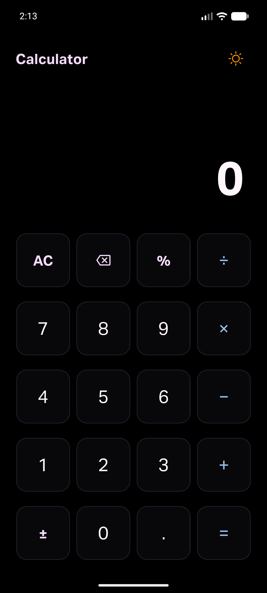
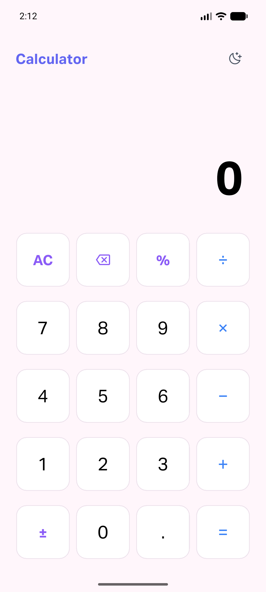
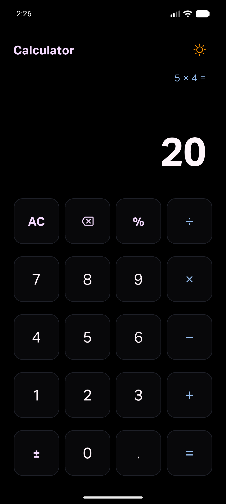
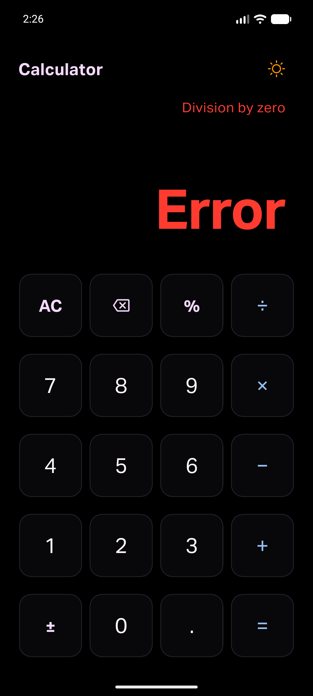
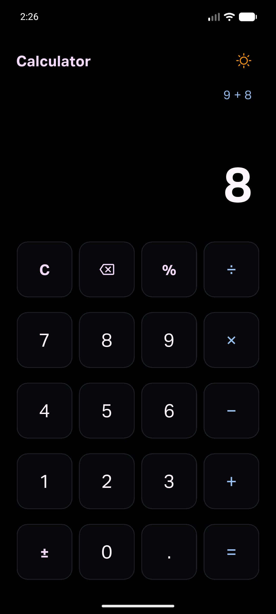

# Assignment 01: Calculator State Lab

**Course:** CSC 4360 · Mobile Application Development (Undergraduate Pathway)  
**Author:** Adi Tauqir  
**Term:** Fall 2026  

---

## Overview

This Flutter application implements a deterministic finite-state calculator enforcing a **running total evaluated strictly left-to-right**, without conventional operator precedence (e.g., `2 + 3 × 4 = 20`). 

The interface combines a minimalist, tactile hardware aesthetic with clean border lines, custom typography using **Aktiv Grotesk**, real-time state feedback, tactile press animations, system haptics, and an animated Sun/Moon morphing theme button.

---

## App Previews

### 1. Distinct Themes (Dark & Light Mode)

<p align="center">
  
  &nbsp;&nbsp;&nbsp;&nbsp;&nbsp;&nbsp;&nbsp;&nbsp;
  
</p>

### 2. State & Pathway Behavior

<p align="center">
  
  &nbsp;&nbsp;&nbsp;&nbsp;
  
  &nbsp;&nbsp;&nbsp;&nbsp;
  
</p>

* **Chained Evaluation (Left):** Evaluates `2 + 3 × 4 = 20` eagerly as a running total.
* **Error Handling (Center):** Intercepts division by zero before IEEE-754 Infinity propagates, displaying `Error` and status `Division by zero`.
* **Clear Entry Hierarchy (Right):** Context-aware top-left keycap dynamically switches from `AC` to `C` while an active number is being entered.

---

## Key Features & Pathways Implemented

### 1. Core Left-to-Right Contract (60 Points)
* **Left-to-Right Evaluation:** Applies pending operations eagerly as each operator is entered (`(2 + 3) = 5`, then `5 × 4 = 20`).
* **Operator Replacement:** Consecutive operator taps replace the pending operator without corrupting intermediate totals (e.g., `9 + × 2 = 18`).
* **Ignored Equals:** Pressing equals while awaiting a second operand is safely ignored (e.g., `7 + = 7`).
* **Fresh Calculation Boundary:** Digit taps immediately following an evaluation start a fresh calculation rather than appending to the previous result.

### 2. Undergraduate Pathway Features (60 Points)
* **Feature 01 · Theme Toggle:** Dual distinct palettes (Pure Pitch Black `#000000` Dark Mode with `#FFF6FB` digits and `#97C0F3` operators, and high-contrast Pale Light Mode) with an animated rotating/scaling Sun/Moon SVG morph button.
* **Feature 02 · Clear / All Clear:** Context-sensitive clear hierarchy. Displays `C` (Clear Entry) while typing an active operand to clear only the input back to `0`, and displays `AC` (All Clear) or activates on long-press to purge the accumulator, operator, and equation history.
* **Feature 03 · Button Press Animations & Haptics:** Custom tactile scale contraction (`AnimatedScale`), clean outline borders with zero glow halos, and instant haptic feedback (`HapticFeedback.lightImpact()`).

Error handling, percentage, sign toggle, backspace, and explicit accessibility labels are implemented as supplemental behavior and are covered by the automated tests.

---

## Architecture & Code Structure

```
calculator_app/
├── fonts/
│   ├── AktivGrotesk_Trial_Rg.ttf
│   └── AktivGrotesk_Trial_Bd.ttf
├── screenshots/
│   ├── dark_mode.png                 # Android preview (Dark Mode)
│   ├── light_mode.png                # Android preview (Light Mode)
│   ├── chained_evaluation.png        # Running total trace (2 + 3 × 4 = 20)
│   ├── error_handling.png            # Division by zero trap (5 ÷ 0 = Error)
│   └── clear_entry.png               # Dynamic Clear Entry (C) state
├── lib/
│   ├── models/
│   │   └── calculator_engine.dart    # Pure Dart FSM state machine
│   ├── theme/
│   │   └── calculator_theme.dart     # Minimalist design tokens (Coolors palette)
│   ├── widgets/
│   │   ├── app_icons.dart            # Custom SVG vector assets
│   │   ├── calculator_header.dart    # Clean header with title and theme toggle
│   │   ├── calculator_screen.dart    # Dual-readout screen (FittedBox auto-scale)
│   │   ├── tactile_button.dart       # 1:1 square button with haptics & scale animation
│   │   └── theme_morph_button.dart   # Animated Sun/Moon morphing button
│   └── main.dart                     # Main application entry point
├── test/
│   ├── calculator_engine_test.dart   # 16 unit tests verifying all FSM transitions & edge cases
│   └── widget_test.dart              # 5 widget tests verifying UI, theme, semantics, and animation
├── Adi_Tauqir_CalculatorApp.apk      # Tested release Android build
└── github_link.txt                   # Plaintext repository link
```

---

## How to Run & Test

### Prerequisites
* Flutter SDK (3.24+ or 3.47+)
* Dart 3.5+
* Android Studio / Android Device or Emulator

### Commands
```bash
# Get dependencies
flutter pub get

# Run on connected device / emulator
flutter run

# Run full automated test suite (21 tests)
flutter test

# Verify code quality and static analysis
flutter analyze

# Build release APK
flutter build apk
```

---

## Automated Test Traces

The test suite covers all required core contract flows and edge cases:
* `2 + 3 × 4 = 20` (Left-to-Right chained operations)
* `9 + × 2 = 18` (Operator replacement)
* `7 + = 7` (Ignored equals)
* `5 ÷ 0 = Error` (Division by zero guard & recovery)
* `AC` eliminates stale accumulator memory
* `C` resets current operand while preserving running accumulator
